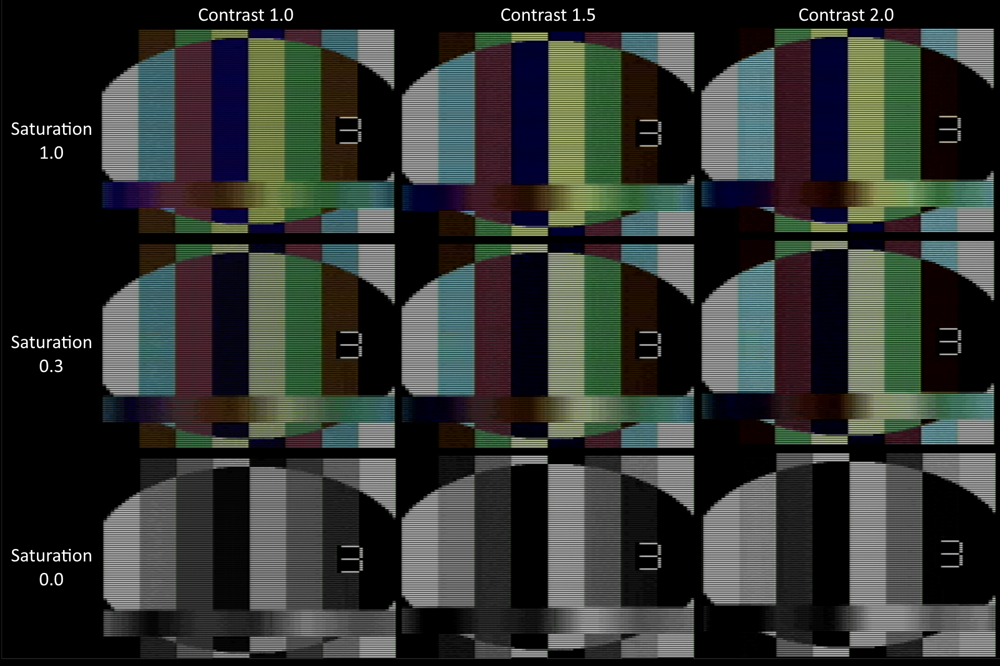
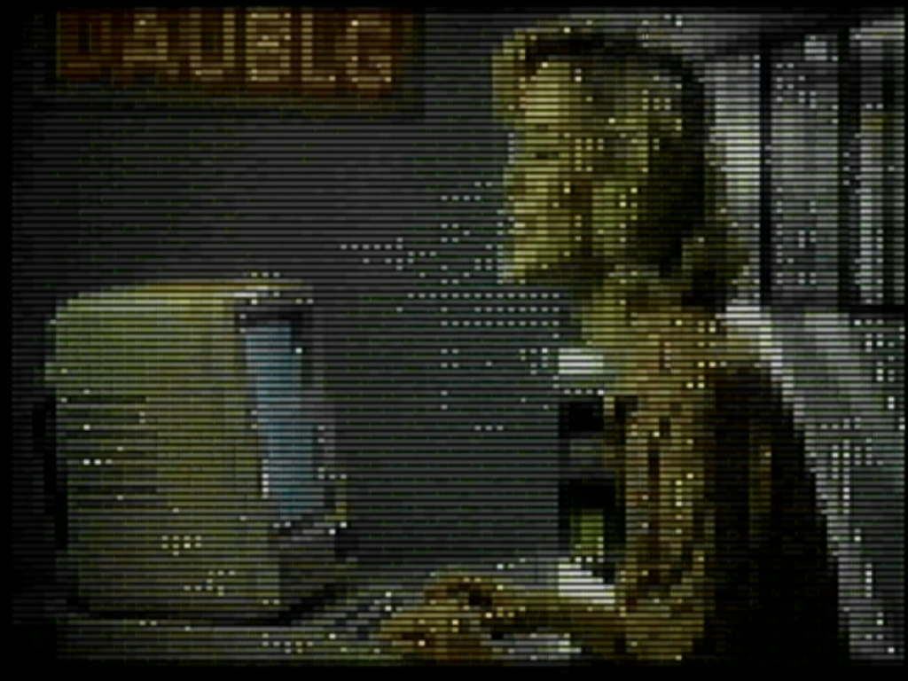
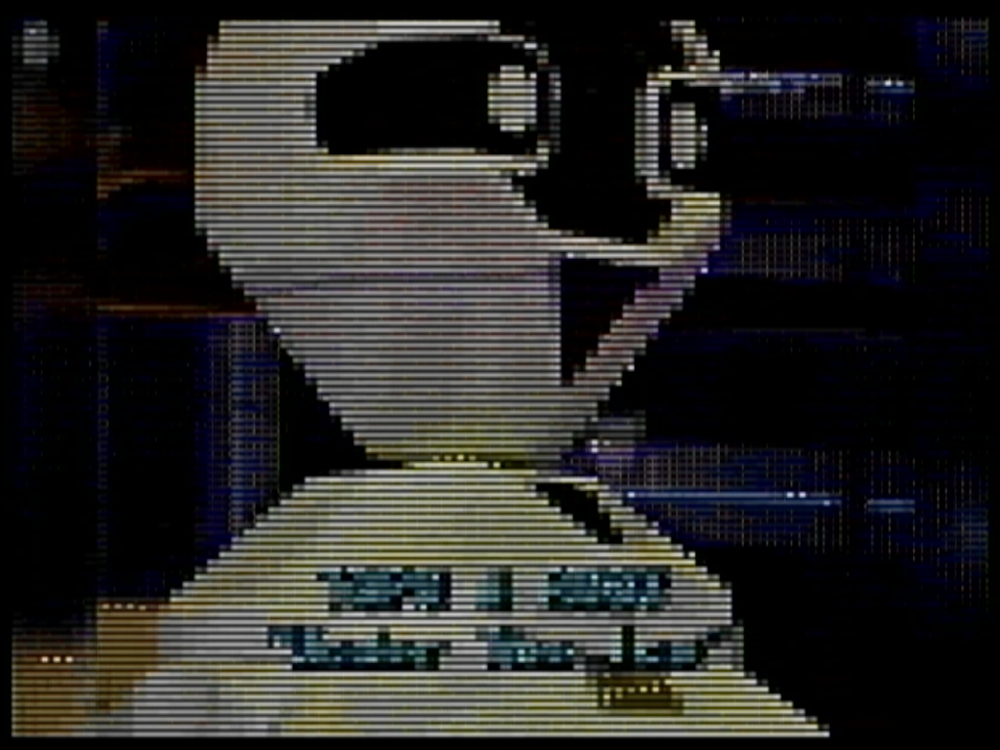
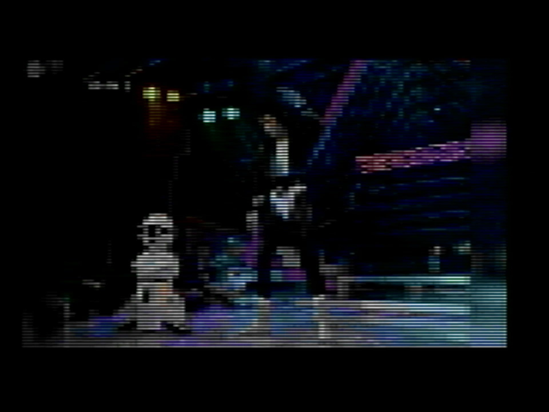

# avi2atari

A modern, all-in-one Python tool for converting video files into the **AVF** format used by **movplay** on **Atari 8-bit** computers.

## Why use this tool?

Historically, creating video content for the Atari 8-bit was a painful, multi-step ritual:

ie.
1. Open video in **VirtualDub**.
2. Resize, change frame rate, and apply specific filters.
3. Export raw audio and raw video separately.
4. Run a specific C++ encoder for video (`encvideo`).
5. Run a separate C++ encoder for audio (`encaudio`).
6. Run a muxer (`mux`) to combine them.
7. Repeat everything if you wanted a different TV standard (PAL/NTSC).

**avi2atari** replaces this entire workflow with a **single command**.

### Key Features:

- **Pipeline Automation:** Uses FFmpeg for robust decoding of almost any input format (MP4, MKV, AVI, MOV, etc.).
    
- **High Performance:** Critical encoding loops are JIT-compiled using **Numba**, making it significantly faster than pure Python implementations.
    
- **Modern Audio Processing:** Implements **EBU R128 Loudness Normalization** (`--loudnorm`) to ensure audio is loud and clear without clipping - a common issue with manual volume adjustment on 8-bit DACs.
    
- **Dual System Support:** Generates correct frame structures for both **PAL (50Hz)** and **NTSC (60Hz)** systems.
    
- **Batch Processing:** Point it to a directory, and it will convert your entire library automatically.
    
- **Structure Integrity:** Includes automated checks to ensure the output file has byte-perfect alignment required by the Atari player hardware.

## Installation

### The easy way (If you are Windows user and not sure what to do):

Open the Command Prompt, then:

    winget install Python.Python.3.10
    winget install ffmpeg
    winget install Git.Git
    git clone https://github.com/HanJammer/avi2atari.git
    cd avi2atari
    python -m pip install -r requirements.txt
    python avi2atari.py

### The right way:

Install prerequisities:
**Python 3.8+** (Python 3.10 recommended)
**FFmpeg**: You must have FFmpeg installed and added to your system's PATH.
 - _Windows:_ Download from [ffmpeg.org](https://ffmpeg.org/), extract, and add the `bin` folder to your System Environment Variables (PATH).
 - _Linux:_ ie. `apt install ffmpeg`

Then:

1. **Clone the repository:**
    
    ```
    git clone https://github.com/HanJammer/avi2atari.git
    cd avi2atari
    ```
    
2. **Create a Virtual Environment (Recommended):**
    
    - **Windows (PowerShell):**
        
        PowerShell
        
        ```
        python -m venv venv
        .\venv\Scripts\activate
        ```
        
    - **Linux / macOS:**
        
        Bash
        
        ```
        python3 -m venv venv
        source venv/bin/activate
        ```
        
3. **Install dependencies:**
      
    ```
    pip install -r requirements.txt
    ```

---

## Usage

### Basic Conversion

Convert a single video file to PAL format (default):

```
python avi2atari.py video.mp4 --system PAL
```

### Batch Processing

Convert all videos in a specific folder:

```
python avi2atari.py D:\MyVideos\ --system PAL
```

### The "Golden Standard" (Recommended)

Use loudness normalization and slightly boost saturation for better visuals on CRT screens:

```
python avi2atari.py matrix.mp4 --system PAL --loudnorm --saturation 1.3
```

### Generate Test Signal

Create a synthesized test file (SMPTE bars + 440Hz tone) to verify your hardware/cabling:

```
python avi2atari.py --test-gen --system PAL
```

---

## Parameters

```
usage: avi2atari.py [-h] [--test-gen] [--system {PAL,NTSC,BOTH}] [--out OUT]
                    [--no-header] [--saturation SATURATION]
                    [--contrast CONTRAST] [--volume VOLUME | --loudnorm]
                    [input]
```

| **Parameter**  | **Description**                                                                                                                                                                                       |
| -------------- | ----------------------------------------------------------------------------------------------------------------------------------------------------------------------------------------------------- |
| `input`        | Input video file path OR a directory for batch processing.                                                                                                                                            |
| `--system`     | Target system: `PAL`, `NTSC`, or `BOTH` (generates two files). Default: `BOTH`.                                                                                                                       |
| `--out`        | Custom output filename (ignored in batch mode).                                                                                                                                                       |
| `--loudnorm`   | **Recommended.** Enables EBU R128 loudness normalization. Ensures consistent volume without distortion.                                                                                               |
| `--volume`     | Manual volume gain in dB (e.g., `10`). Use only if loudnorm is disabled. Default: `12.0`.                                                                                                             |
| `--saturation` | Color saturation boost. `1.0` is original. Try `1.3` - `1.5` for vivid colors.                                                                                                                        |
| `--contrast`   | Contrast adjustment. `1.0` is default.                                                                                                                                                                |
| `--no-header`  | Disables the 8KB blank header. **Warning:** This is test/debug option! Only use this if you know exactly how your loader works. Most players (like `movplay`) require the header for synchronization. |
| `--test-gen`   | Generates a `test_tone.mp4` file and converts it. Useful for debugging audio issues and tuning contrast/saturation.                                                                                   |

### Parameter Comparison

**Saturation vs Contrast matrix**



### Output examples

**"DAUBLG Makes it Right!"** ([source video](https://www.youtube.com/watch?v=Pq7VeyPghbY)).

Download AVF: [PAL](https://drive.google.com/file/d/1xqwC5dUnTEuFpL4qeniVdj2TtK0Gm0vs/view?usp=sharing) [NTSC](https://drive.google.com/file/d/1UhUVOQMtQdMp4kDoz1Lhlnayg7lL8b0n/view?usp=sharing)

| **Sample 1**                                | **Sample 2**                                |
| --------------------------------------------| ------------------------------------------- |
|  |  |

**Topo & Roby "Under the Ice" (Live)** ([source video](https://www.youtube.com/watch?v=iR7pwtqyZio)).

| **Sample 1**                                        | **Sample 2**                                        |
| ----------------------------------------------------| --------------------------------------------------- |
|  |  |

---

## Limitations & Hardware Notes

I tested the output files extensively on my Atari 130XE with SUB Cart (yet to be tested on my 800XL).

1. **Storage Speed:** Playing AVF video requires a data transfer rate of approx. **8.7 KB/frame** (over 430 KB/s). This requires fast storage solutions like **SUB Cart** (tested), **AVG Cart** (not tested but should work just like SUB Cart), **SIDE3** (needs testing). Standard floppy emulators (SIO2SD) are too slow.
    
2. **Emulator Configuration:** If testing on **Altirra**, you MUST enable **"Use burst I/O transfers"** in the Hard Disk configuration. Without it, the emulator simulates seek times, causing video glitches. It's very likely to glitch-out/loose synchronisation anyway.
    
3. **Audio Quality:** The audio is essentially 4-bit software PCM played through the POKEY chip. A high-pitched carrier whine (~15kHz) is normal and part of the technology, not a bug.
    
4. **Color Palette:** The Atari GTIA chip has a limited palette. The converter uses dithering to simulate more colors, but some degradation (especially in reds) is expected compared to the source material.

---

## Contributing

This tool was created to modernize the Atari 8-bit video ecosystem.

Testing and debugging was done on the PAL hardware only. NTSC is mostly untested - if you have NTSC computer and can test the output AVFs - this would be a great help to make this program better.

If you find bugs or have ideas for better dithering algorithms:

1. Fork the repo.
    
2. Create your feature branch.
    
3. Submit a Pull Request.

**Credits:**

- Original concept: phaeron encvideo/encaudio/mux C++ sources.
    
- Python Port & Engineering: HanJammer & Lumen.
    
- Special thanks to MNEMOS for AVF format structural analysis.

**Happy streaming!**
